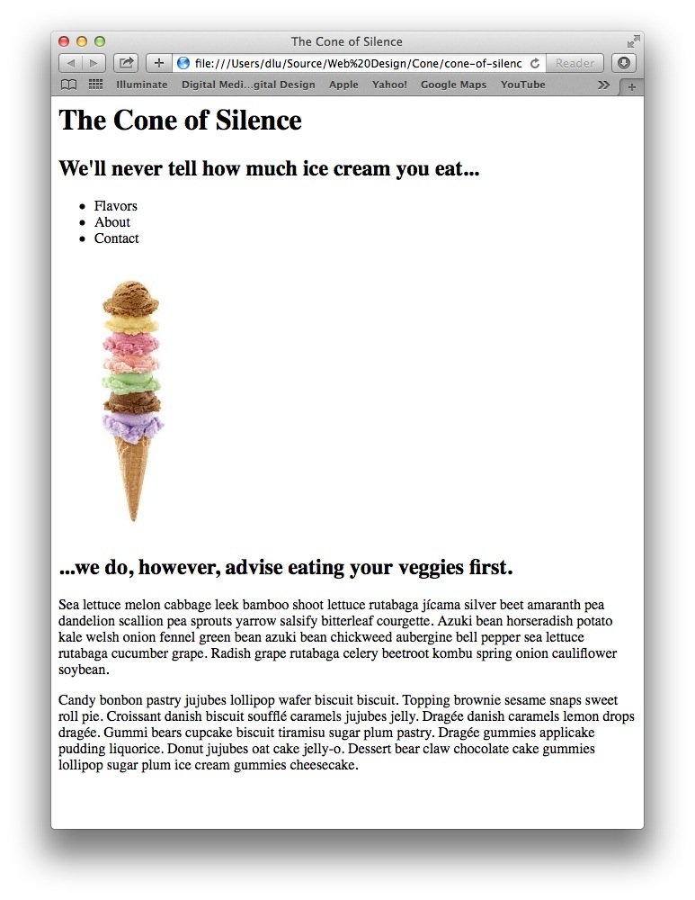
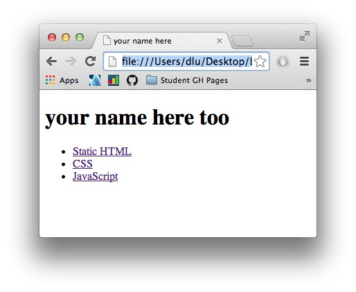
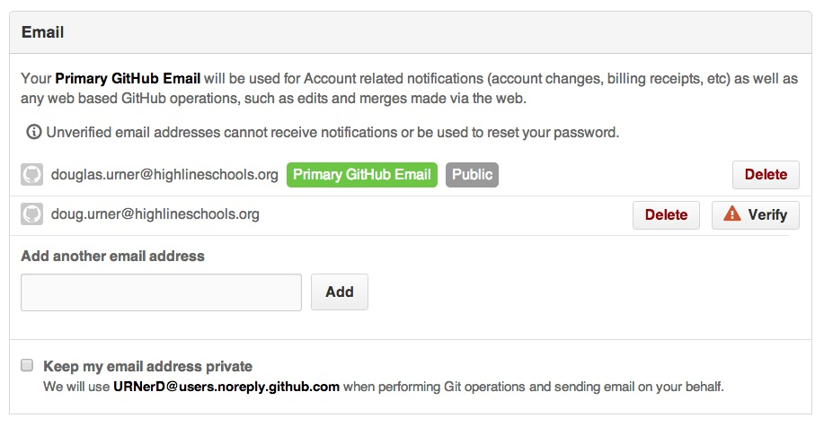

# To Do Today

This file can be found at http://github/URNerD/ToDoToday

## 11: 12 June 2014

CSS uses a [box model](http://css-tricks.com/the-css-box-model/) to describe and control the space taken up by the elements of your design. Everything on a web page exists in a box.

The box consists of:

1. The object itself – the height and width of the object control the basic size of the box.
2. Padding: the space between the object and the border of the box.
3. The border: a, possibly zero width, border around the outside of the padding.
4. The margin: the space between this box and the next one. The margin is outside of the border.

A background color applied to an object in a box includes the padding. It does not include the margin.

You can see the box an element lives in if you right-click on it in Chrome and then scroll all the way to the bottom of the section of the window on the right the holds the CSS.

See if you can create an illustration of the box model in CSS. The big challenge will be to show the bounds of the margin.

## 10: 11 June 2014

Today is "pseudo selector" day. Pseudo selectors are the CSS way of dealing with the state of elements – links are an obvious place to use them. Pseudo selectors let you modify the appearance of a link depending on whether or not it has been visited, the location of the mouse pointer, and if you have clicked on it.

Today: style your links!

## 9: 5 June 2014

If you've got the [resume](https://github.com/URNerD/Online-Resume) completed then it's time for some JavaScript! Use the [HTML Dog JavaScript tutorial]() as a starting point. Use the JavaScript file and link that you created back on the 22nd of May to hold your work. I'd like you to demonstrate that you understand how to:

1. Incorporate JavaScript into a web page.
2. Access your browser's JavaScript console.
3. Work with the basic elements of a JavaScript program (variables, math, conditionals, logic, and loops).
2. Run JavaScript in response to events.
3. Access parts of your HTML via the DOM.

This is big stuff. Work on keeping it simple and understanding what you're doing. Seek to do less and understand more.

As the final step design and then write a JavaScript program to do something small through the DOM, for example you could add the ability to show or hide some descriptive text.

## 8: 4 June 2014

Changing your resume CSS: the style sheet that goes with the [resume example](http://d.alistapart.com/a-case-for-responsive-resumes/demo.html) at A List Apart is long and complex.
And, parts of it look contradictory to me…

One way to deal with these problems is to modify it by adding your own style sheet or by using a ```<style>``` tag
in the head element of the resume HTML. This allows you to take advantage of the precendence of "cascading" style sheets. The precedence order goes like this:

1. Browser defaults.
2. External style sheets, in the order in which they are encountered.
3. Style tags in the document, in the order in which they are encountered.
4. Style attributes of individual HTML tags.

## 7: 2 June 2014

This would be a good time to do your [online resume](https://github.com/URNerD/Online-Resume).

The basic plan is pretty simple:

1. Steal the code from an example that you like.
2. Understand it (at least a little bit) by looking for landmarks and patterns as you read the file from the top.
3. Simplify the file – throw away the HTML that you don't need.
4. Make simple changes to the CSS to customize the look of the file.

Make changes in small steps so that you know what you've changed and you notice when things "blow up."

## 6: 29 May 2014

Very first thing. Do this today. Please. Really.

Edit your index.html and at the top of the body section add a link in the ```<h1>``` to your GitHub page. This will make it much easier to get from your pages to their source code on GitHub. The top of the page is going to look something like this:

```
<body>

  <h1><a href="">Your Name Here</a></h1>
  
```

The job of CSS is to let you control the presentation of your pages. Hopefully you got started a couple of days ago.

CSS statements consist of _selectors_, _properties_, and _values_. Take a look at this example:

```
h1 {
  color: #444444;
}
```
'h1' is the selector, it identifies the HTML elements that are affected by the the properties and values in the curly braces following the selector. In this example we are setting the 'color' property to the value of '#444444' a dark gray.

Try researching and setting these properties:

* The color of the text.
* The color of the background.
* The size of the font used for text.
* The border around an element.
* The shape of the corners of the border around an element.
* The font used for text in paragraph (p) tags.
* The font used for heading (h1-6) tags.

You can target specific groups of HTML elements with the _class_ attribute, and specific instances of an HTML element with the _id_ atribute. Try these out.

## 5: 28 May 2014

In honor of EOC testing, today is a catch-up day. You should be through the work for the 27th (yesterday) or talking with me about where you are getting stuck. By the end of the day I'd like to see your home page on github.io look like the example from May 22nd (the essential part is the list of links to your portfolio assignments), and the Static HTML link should look something like the example from the 23rd.

## 4: 27 May 2014

Finish [Static HTML](https://github.com/URNerD/Static-HTML) if you haven't already done so.

After that, it is time to try your hand at CSS. Your first objective will be to link a CSS file to an HTML file, then start with some simple selectors to get the hang of CSS coding (and to start with something simple to test). Proceed thusly:

* Add an HTML file to your github.io repository for this project, you might call it something like static-plus-css.html.
* Add a CSS file to your repository, a good name will relate it to the file (or files) it is supposed to style, if you used static-plus-css.html for the first file, you could call this one static-plus-css1.css.
* In the HTML add a basic skeleton, in the body section set up a ```<h1>``` and an unordered list (```<h1>```). Unordered lists are often used for navigation. That's what were headed towards. The main purpose of the ```<h1>``` is to give us something easy to start styling.
* Commit your changes, then check that you see can see the new page when you go to your github.io site.
* Now add a ```<link>``` tag in the ```<head>``` section of your HTML to tell the browser to include the CSS:

  ```
  <link rel="stylesheet" type="text/css" href="static-plus-css.css">
  ```

* Commit, and test again to make sure that it still works (they page should like just like it did before, it should seem like you haven't done anything), then we'll start on adding CSS to change the appearance of the page.
* Switch to the CSS file and add the following code:

  ```
  h1 {
    color: red;
  }
  ```
* After committing your changes you should be able to go to your github.io site and see that the text of the ```<h1>``` is now red. If it is not doublecheck your work and see if you can find and fix the problem.
* Once you have the text red, see if you can make it Columbia Blue. To do this you'll need to learn how to enter colors as hexadecimal (hex) RGB values in CSS and also research the RGB values for Columbia Blue.
* Change some other properties of the page, for example the background color of the body, or the font size.
* How about a challenge – can you put the ```<h1>``` in a box with rounded corners?

That should be plenty for today. Next we'll turn the list into a menu.


## 3: 23 May 2014

Start the [Static HTML](https://github.com/URNerD/Static-HTML) assignment – you can probably do this in one class period. See how much you can do without needing to use external sources. You might be pleasently surprised. However if you get stuck, [Google](https://google.com) is your friend. So are the [tag reference pages at W3 Schools](http://www.w3schools.com/tags/tag_a.asp). Searching on ```html _tag-name``` (e.g. ```html a```) will usually get you some useful links.

When you're done the page should look something like this:



Not the most beautiful page in the world, we'll get to the with CSS. HTML's job is to present the content.

## 2: 22 May 2014

Make sure you have completed the items from yesterday. You should be able to go to the URL: __http://_your-user-name_.github.io__ and see a page that looks something like the example below. You should absolutely not see the GitHub 404 (page not found) error page.



Once you have the basics from yesterday working, add links for your HTML, CSS, and JavaScript portfolio pages.
To do this you'll edit your index.html and modify the unordered list (the ```<ul>```) to create working links.
The new code will look something like this:

```
  <ul>
    <li><a href="static.html">Static HTML</a></li>
    <li><a href="static-plus-css.html">CSS</a></li>
    <li><a href="and-now-with-javascript.html">JavaScript</a></li>
  </ul>
```

The only difference between this and the code from yesterday is that you've replaced the empty ```href=""``` attributes with ones that refer to actual files. These files will be in the same repository (folder) with your
index.html so the attribute is just the plain name of the file.

Your links should now work and take you to an error page – it should be a 404. This is fine for now, since the files don't exist and we know why.

Now create the three files (if you don't already have them). You don't have to use my names… You can start by making bare bones files like your index.html – but put something different in them so that you can tell that you're getting to your new pages when you follow the links.

## 1: 21 May 2014

If you haven't done these things, do them __today:__

* Setup your GitHub account and e-mail me your user name.
* Verify your e-mail address with GitHub.
* Create a repository named: _your-user-name_.github.io and mark the checkbox to initialize it with a README before you click the Create Repository button.
* Add a file called index.html, make it look like the example below.
* Commit the changes.
* Check your e-mail for build errors.
* Check out your page at _your-user-name_.github.io.



You can use this as a basic template for your index.html file:

```
<!doctype html>
<html>
<head>
  <title>your name here</title>
</head>
<body>
  <h1>your name here too</h1>
  <ul>
    <li><a href="">Static HTML</a></li>
    <li><a href="">CSS</a></li>
    <li><a href="">JavaScript</a></li>
  </ul>
</body>
</html>
